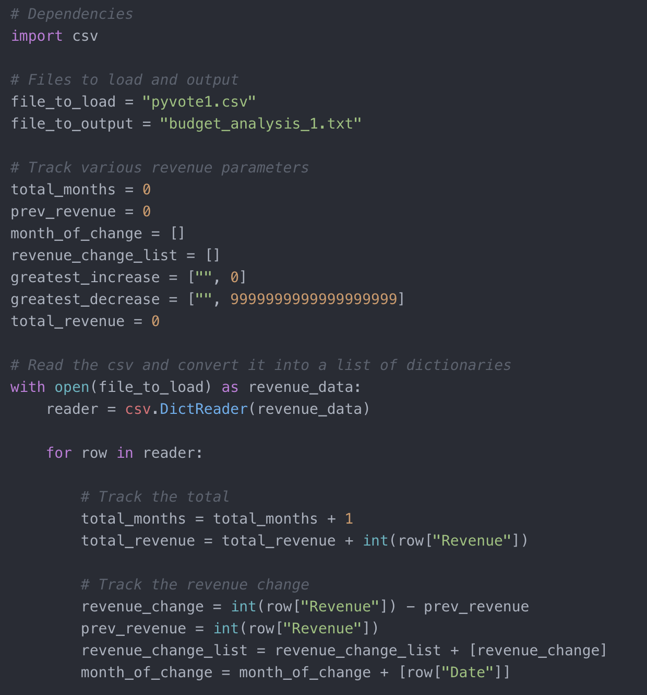
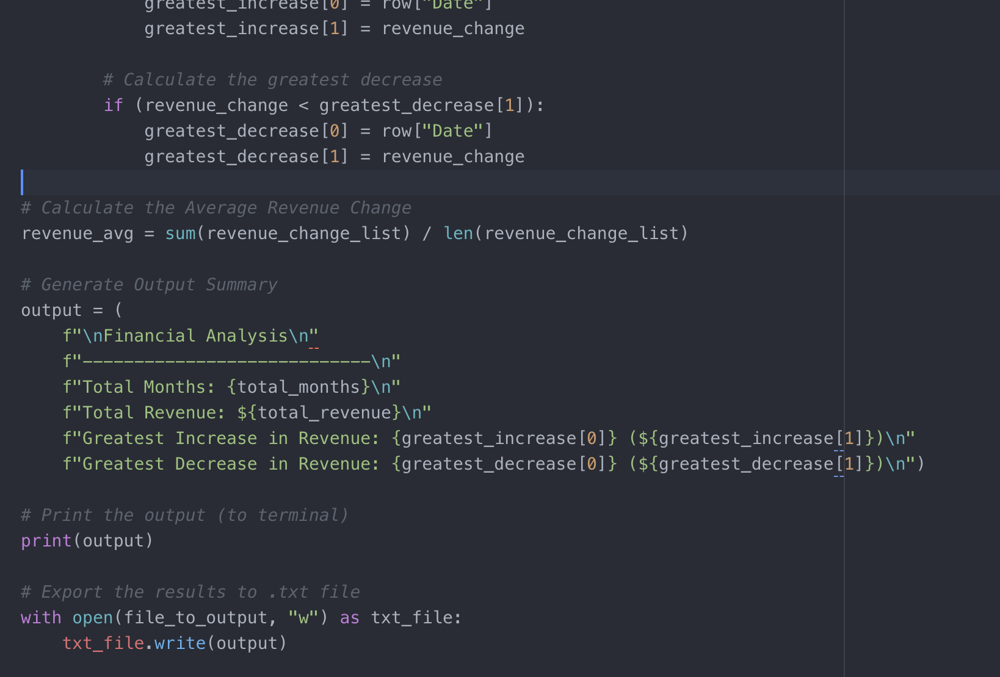

Gaining insights with Python
PyBank/Pyvote

1. Pybank - Using a Python script, we gained information from a CSV of Sales revenue data and exported the results to a .txt file

The total number of months included in the dataset

The total amount of revenue gained over the entire period

The average change in revenue between months over the entire period

The greatest increase in revenue (date and amount) over the entire period

The greatest decrease in revenue (date and amount) over the entire period

